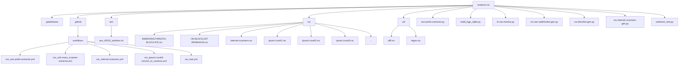

# RouterOS RSC Repository Overview

## Directory Tree
```text
routeros-rsc/
├─ .gitattributes
├─ .github/
│   └─ workflows/
│       ├─ run_asn-prefix-extractor.yml
│       ├─ run_cidr-mass_scanner-extractor.yml
│       ├─ run_internet-scanners.yml
│       ├─ run_ipsum-Level3-convert_to_routeros.yml
│       └─ run_test.yml
├─ asn/
│   └─ asn_45102_prefixes.txt
├─ rsc/
│   ├─ EMERGINGTHREATS-BLOCK-IPS.rsc
│   ├─ HN-BLACKLIST-SPAMHAUS.rsc
│   ├─ internet-scanners.rsc
│   ├─ ipsum-Level1.rsc
│   ├─ ipsum-Level2.rsc
│   ├─ ipsum-Level3.rsc
│   ├─ ipsum-Level4.rsc
│   ├─ ipsum-Level5.rsc
│   ├─ ipsum-Level6.rsc
│   ├─ ipsum-Level7.rsc
│   ├─ ipsum-Level8.rsc
│   ├─ IPV64.NET-IPV64_BLOCKLIST_V4_CN.rsc
│   ├─ IPV64.NET-IPV64_BLOCKLIST_V4_JP.rsc
│   ├─ IPV64.NET-IPV64_BLOCKLIST_V4_KR.rsc
│   ├─ IPV64.NET-IPV64_BLOCKLIST_V4_TW.rsc
│   ├─ IPV64.NET-IPV64_BLOCKLIST_V6_CN.rsc
│   ├─ IPV64.NET-IPV64_BLOCKLIST_V6_JP.rsc
│   ├─ IPV64.NET-IPV64_BLOCKLIST_V6_KR.rsc
│   ├─ IPV64.NET-IPV64_BLOCKLIST_V6_TW.rsc
│   ├─ IPV64.NET-TOREXITNODES.rsc
│   ├─ mass_scanner.rsc
│   ├─ mass_scanner_v6.rsc
│   ├─ mikrotik_as_lists.rsc
│   ├─ SPAMHAUS-DROPV6.rsc
│   ├─ STAMPARM-IPSUM-LEVEL-1.rsc
│   ├─ STAMPARM-IPSUM-LEVEL-2.rsc
│   ├─ STAMPARM-IPSUM-LEVEL-3.rsc
│   ├─ STAMPARM-IPSUM-LEVEL-4.rsc
│   ├─ STAMPARM-IPSUM-LEVEL-5.rsc
│   ├─ STAMPARM-IPSUM-LEVEL-6.rsc
│   ├─ STAMPARM-IPSUM-LEVEL-7.rsc
│   └─ STAMPARM-IPSUM-LEVEL-8.rsc
├─ util/
│   ├─ diff.rsc
│   └─ regex.rsc
├─ asn-prefix-extractor.py
├─ build_bgp_sqlite.py
├─ bgp.sqlite
├─ fx-ma-monitor.py
├─ ipsum-Level3-convert_to_routeros.py
├─ mass_scanner-extractor.py
├─ README.md
├─ requirements.txt
├─ ros-asn-addresslist-gen.py
├─ ros-blocklist-gen.py
├─ ros-internet-scanners-gen.py
└─ selenium_test.py
```

## Key Files & Brief Description
| Path | Purpose |
|------|---------|
| `README.md` | Project overview, usage instructions, and dependency list. |
| `requirements.txt` | Python package requirements for the scripts in the repo. |
| `asn-prefix-extractor.py` | Extracts ASN prefixes from source data and writes them to text files. |
| `ros-asn-addresslist-gen.py` | Generates Mikrotik RouterOS address‑list files from ASN data. |
| `ros-blocklist-gen.py` | Produces block‑list scripts for RouterOS. |
| `ros-internet-scanners-gen.py` | Generates RouterOS scripts that block known Internet scanners. |
| `fx-ma-monitor.py` | Monitors and reports on FortiGate/FX‑MA devices (specific to the author's environment). |
| `selenium_test.py` | Simple Selenium test harness used for CI validation of the generated scripts. |
| `rsc/ipsum-Level*.rsc` | Pre‑defined RouterOS firewall rule sets (Level 1‑8) for different security tiers. |
| `rsc/IMPV64.NET-*.rsc` | IP block‑list files sourced from the IPV64.NET project, split by country and IP version. |
| `util/regex.rsc` | Helper script that iterates over firewall address‑list entries and prints address + comment. |
| `util/diff.rsc` | Utility script for comparing two address‑list snapshots. |

## Mermaid Diagram (Directory Structure)


## How to Use the Repo
1. **Install Python dependencies** – `pip install -r requirements.txt`.
2. **Run the generator scripts** – e.g., `python ros-asn-addresslist-gen.py` will output `.rsc` files under `rsc/`.
3. **Deploy to RouterOS** – copy the generated `.rsc` files to your MikroTik device and import them.
4. **Utility scripts** – the `util/` folder contains helper scripts (`regex.rsc`, `diff.rsc`) that you can run directly on the router for debugging address‑list contents.

---
*Generated automatically as part of the repository inspection plan.*
